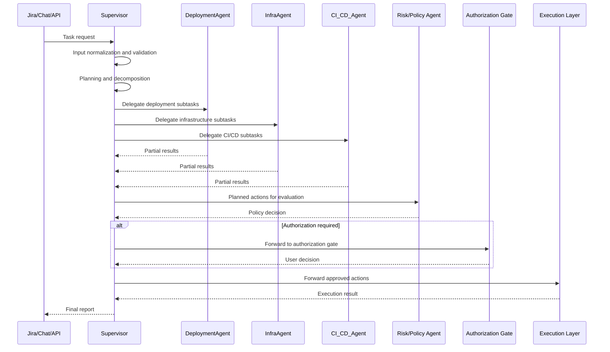

# Agentic Platform Engineer

## Project and Supervisor Component Specification

## 1. Document Purpose

### 1.1 Intended Use

This document is the working technical specification for the `Agentic Platform Engineer` project and should be used as the main project context for future analytical, architectural, and implementation tasks.

It combines two levels of description:

- the project level, including system goals, architecture, agent roles, flows, and constraints
- the `Supervisor` component level, as the main workflow coordinator

### 1.2 Relation to the Source Specification

This document extends and reorganizes the information contained in:

- `plan/Specyfikacja projektu_ Agentic Platform Engineer z Bramkami Uprawnień.docx`

It does not change the core project assumptions. It standardizes them, expands them operationally, and preserves them in a versionable format.

### 1.3 How to Use This Document

This file should be treated as the reference project context. For future tasks, the following assumptions should apply unless explicitly overridden:

- `Supervisor` is the central orchestrator
- operations are multi-agent and auditable
- changes are executed with policy enforcement and authorization gates
- planning, risk evaluation, and execution are separated responsibilities

## 2. Project Summary

### 2.1 Business Problem

The project is intended to automate Platform Engineering and DevOps tasks such as:

- application deployments
- infrastructure configuration
- diagnostics and environment analysis
- CI/CD pipeline control

The system should reduce execution time for operational tasks, decrease manual error rates, and improve transparency of operational activities.

### 2.2 Solution Model

The system accepts requests from operational channels, breaks them down into steps, routes them to specialized agents, collects results, evaluates planned actions against policy and risk, and then publishes a final report.

The operating model is based on:

- multi-agent orchestration
- persistent workflow state
- full audit traceability
- authorization gates for higher-risk actions

### 2.3 Core Architectural Principle

The system separates:

- planning and coordination
- compliance and risk evaluation
- technical execution

This separation is critical for security, compliance, and observability.

## 3. Project Goals

### 3.1 Business Goals

- reduce DevOps task completion time from days or weeks to hours
- reduce operational cost and the number of manual interventions
- improve predictability of deployments and infrastructure changes
- improve status communication quality for end users

### 3.2 Technical Goals

- secure orchestration of agent workflows
- full workflow traceability and decision auditability
- clear responsibility boundaries between planning, control, and execution
- support for multiple concurrent requests

### 3.3 Success Metrics

- time to first system response
- average time to complete a request
- percentage of successful deployments and changes
- number of human interventions per task
- compliance of execution with policy and authorization processes

## 4. System Scope

### 4.1 In Scope

The system includes:

- receiving requests from `Jira`, `chat`, and `API`
- input validation and normalization
- planning and task decomposition
- delegation of steps to specialized agents
- result aggregation
- evaluation of planned actions by `Risk/Policy Agent`
- user authorization handling for actions that require approval
- passing approved actions to the execution layer
- reporting status, results, and artifacts

### 4.2 Out of Scope

The following are outside the scope of this component-level specification:

- implementation details of individual infrastructure tools
- exact organizational policies for every environment or tenant
- the final choice of cloud provider, if not project-defined
- detailed logic of a specific executor runtime

## 5. Users and Input Channels

### 5.1 User Roles

#### System Administrator

Responsible for solution configuration, access policies, integrations, secrets, and operational oversight.

#### DevOps Engineer / Platform Engineer

Submits tasks, monitors execution, answers clarification questions, and makes authorization decisions when required by the workflow.

#### External System User

May initiate tasks through integrated APIs or intermediary systems.

### 5.2 Input Channels

The system accepts requests from:

- `Jira`
- `chat`
- `API`

### 5.3 Output Channels

The system publishes status and the final report to:

- a `Jira` comment or issue update
- a `chat` thread
- an `API` response or callback

## 6. Design Principles

### 6.1 Orchestration Instead of Monolithic Execution

The system must plan and delegate work instead of executing everything in a single component.

### 6.2 Explicit Permission Boundaries

Each change must pass through defined layers of validation, policy checks, and authorization.

### 6.3 Audit First

Every meaningful decision, delegation, sub-agent response, and execution result should be reconstructable.

### 6.4 Human-in-the-Loop

Risky or policy-controlled actions must support workflow interruption until a user decision is received.

### 6.5 Separation of Concerns

`Supervisor`, sub-agents, the `Risk/Policy` layer, and the execution layer have separate responsibilities.

## 7. High-Level Architecture

### 7.1 Main Components

#### `Supervisor`

The central workflow coordinator. It receives the request, plans steps, delegates work, collects results, and publishes the final report.

#### `DeploymentAgent`

The agent responsible for application deployment tasks, release orchestration, and preparation of deployment-related actions.

#### `InfraAgent`

The agent responsible for analyzing and preparing infrastructure-related steps, resource configuration, and environment dependencies.

#### `CI_CD_Agent`

The agent responsible for pipelines, builds, artifacts, and CI/CD process rules.

#### `Risk/Policy Agent`

The component responsible for evaluating planned actions against policies, risk level, and authorization requirements.

#### Execution Layer

The execution layer performs approved technical operations through controlled tools, APIs, or scripts.

#### Human Review Interface

The integration layer used for `interrupt/HITL`, such as `Jira`, `chat`, or another approval UI.

#### Logging / Tracing / Persistence

The layer responsible for execution trace capture, workflow state, checkpointing, and execution metadata.

### 7.2 Dependency Model

`Supervisor` depends on:

- input from operational channels
- responses from sub-agents
- decisions from `Risk/Policy Agent`
- the execution layer for final execution status

Sub-agents and the execution layer must not take over the planning role of `Supervisor`.

## 8. Supervisor as the Main Workflow Coordinator

### 8.1 Role Definition

`Supervisor` is the main workflow coordinator of the agent platform. It is responsible for driving the task from the moment the request is received until the final report is published.

`Supervisor` operates as an orchestration and flow-control layer. It is not an execution component for infrastructure operations.

### 8.2 Responsibilities

`Supervisor` is responsible for:

- receiving requests from `Jira`, `chat`, and `API`
- normalizing input into a shared data model
- validating input for completeness, format, and minimum execution requirements
- detecting missing information and preparing clarification questions
- planning steps and decomposing the task into subtasks
- assigning subtasks to `DeploymentAgent`, `InfraAgent`, and `CI_CD_Agent`
- passing the appropriate task context to sub-agents
- collecting and aggregating subtask results
- preparing planned actions for review by `Risk/Policy Agent`
- handling policy and authorization decisions
- passing approved actions to the execution layer
- generating the final report
- publishing status to the source channel
- maintaining consistent workflow state for audit and resume purposes

### 8.3 Non-Responsibilities / Guardrails

The following statements are mandatory and must not be reinterpreted:

- `Supervisor does not directly perform infrastructure operations and does not initiate changes in the environment.`
- `Supervisor does not bypass authorization gates, security policies, or Risk/Policy Agent decisions.`

Additional constraints:

- `Supervisor` does not directly call infrastructure tools as a workaround for the execution layer
- `Supervisor` does not self-approve actions that require user authorization
- `Supervisor` does not override `Risk/Policy Agent` decisions
- `Supervisor` does not forward actions for execution outside the approved plan

### 8.4 Ownership Boundaries

`Supervisor` owns:

- input state
- plan state
- subtask statuses
- policy evaluation status
- overall final task status

It does not own:

- technical command execution
- raw infrastructure permissions
- compliance decisions made by the policy layer

## 9. Roles of the Other Agents

### 9.1 `DeploymentAgent`

Responsible for:

- analyzing and planning deployment actions
- preparing release steps
- assessing deployment dependencies
- reporting results in a standardized format

### 9.2 `InfraAgent`

Responsible for:

- analyzing infrastructure changes
- evaluating impact on resources and environments
- preparing configuration and provisioning-related actions
- reporting results in a standardized format

### 9.3 `CI_CD_Agent`

Responsible for:

- pipeline analysis
- validation of artifacts and build/release stages
- identifying CI/CD blockers
- reporting results in a standardized format

### 9.4 `Risk/Policy Agent`

Responsible for:

- classifying risk of planned actions
- evaluating compliance with policy
- determining whether user authorization is required
- issuing an allow, block, or approval-required decision

### 9.5 Execution Layer

Responsible for:

- executing approved actions
- using tools and APIs in a controlled runtime
- reporting execution status, logs, and errors

## 10. End-to-End Workflow

### 10.1 Main Flow

1. A user or external system submits a task through `Jira`, `chat`, or `API`.
2. `Supervisor` receives the request.
3. `Supervisor` normalizes and validates the input.
4. If information is missing, `Supervisor` generates clarification questions and pauses further planning until a response is received.
5. `Supervisor` creates a plan and decomposes the task into steps.
6. `Supervisor` delegates subtasks to `DeploymentAgent`, `InfraAgent`, and `CI_CD_Agent` according to responsibility boundaries.
7. Sub-agents return partial results.
8. `Supervisor` aggregates the results and builds the list of planned actions.
9. `Supervisor` passes the planned actions to `Risk/Policy Agent`.
10. `Risk/Policy Agent` returns a decision.
11. If authorization is required, the workflow goes through the user approval gate and waits for a decision.
12. After approval is received, or if no approval is required, `Supervisor` passes the approved actions to the execution layer.
13. The execution layer performs the operations and returns the result.
14. `Supervisor` generates the final report and publishes it to the source channel.

### 10.2 Core Workflow Rule

- technical execution remains the responsibility of execution components, not `Supervisor`

### 10.3 Interruption Scenarios

The workflow may be paused if:

- input is incomplete
- the plan contains actions that require additional authorization
- `Risk/Policy Agent` blocks the operation
- the execution layer returns an error that requires a user decision

## 11. Interaction Sequence



## 12. Logical Contracts

The detailed Supervisor intake contract, validation rules, and clarification marking model are defined in:

- `plan/supervisor-input-spec.md`

### 12.1 `SupervisorInput`

Input model passed to `Supervisor`.

```json
{
  "request_id": "req-123",
  "source": "jira|chat|api",
  "user_request": "Deploy service X to the stage environment",
  "parameters": {
    "environment": "stage",
    "service": "service-x"
  },
  "context": {
    "ticket_id": "OPS-101",
    "user_id": "devops-user",
    "channel_ref": "jira-comment-or-chat-thread"
  }
}
```

Required fields:

- `source`
- `user_request`
- `parameters`
- `context`

### 12.2 `SupervisorPlan`

Plan model generated by `Supervisor`.

```json
{
  "request_id": "req-123",
  "status": "planned",
  "steps": [
    {
      "step_id": "step-1",
      "target_agent": "DeploymentAgent",
      "task": "Prepare the deployment plan for service X on stage",
      "dependencies": [],
      "status": "pending"
    },
    {
      "step_id": "step-2",
      "target_agent": "InfraAgent",
      "task": "Validate infrastructure dependencies for the stage environment",
      "dependencies": ["step-1"],
      "status": "pending"
    },
    {
      "step_id": "step-3",
      "target_agent": "CI_CD_Agent",
      "task": "Validate the pipeline and release artifacts",
      "dependencies": [],
      "status": "pending"
    }
  ]
}
```

Required fields:

- `steps`
- `target_agent`
- `dependencies`
- `status`

### 12.3 `SupervisorResult`

Aggregated result model produced by `Supervisor`.

```json
{
  "request_id": "req-123",
  "subtask_results": [
    {
      "agent": "DeploymentAgent",
      "status": "success",
      "details": "Deployment plan prepared"
    },
    {
      "agent": "InfraAgent",
      "status": "success",
      "details": "No infrastructure blockers detected"
    },
    {
      "agent": "CI_CD_Agent",
      "status": "success",
      "details": "Pipeline is ready to run"
    }
  ],
  "policy_decision": {
    "allowed": true,
    "requires_approval": false,
    "reason": "Operation complies with policy for the stage environment"
  },
  "final_report": {
    "status": "completed",
    "summary": "The plan was executed in compliance with policy",
    "published_to": "jira"
  }
}
```

Required fields:

- `subtask_results`
- `policy_decision`
- `final_report`

### 12.4 Policy Decision Contract

Minimum logical contract for the `Risk/Policy Agent` response:

```json
{
  "allowed": true,
  "requires_approval": false,
  "reason": "string",
  "blocked_actions": [],
  "approved_scope": ["action-id-1"]
}
```

## 13. Planning and Delegation Rules

### 13.1 Planning Rules

The plan created by `Supervisor` should:

- be explicit and auditable
- separate analysis from execution
- define dependencies between steps
- identify the owner of each subtask
- be evaluable by `Risk/Policy Agent`

### 13.2 Delegation Rules

`Supervisor` delegates tasks only to the appropriate domain agents:

- `DeploymentAgent` for deployment-related actions
- `InfraAgent` for infrastructure-related actions
- `CI_CD_Agent` for pipeline and release-flow-related actions

Each delegation must include:

- the step objective
- the responsibility scope
- the required operational context
- dependencies on other steps
- the expected response format

### 13.3 Aggregation Rules

`Supervisor` aggregates:

- subtask statuses
- substantive results returned by sub-agents
- the list of planned actions
- the policy evaluation result
- the final execution status

## 14. Security and Governance

### 14.1 Core Security Requirements

The system must provide:

- an allowlist of tools and integrations
- input and output validation
- isolation of the execution environment
- secret handling outside prompts and logs
- full audit traceability

### 14.2 Policy and Authorization

Any planned action that:

- affects a production environment
- changes infrastructure state
- may cause downtime
- has consequences that are difficult to reverse

should be evaluated by `Risk/Policy Agent` and, if required by policy, routed for user authorization.

### 14.3 Hard Prohibitions

- `Supervisor` must not bypass the `interrupt/HITL` process
- `Supervisor` must not initiate changes as a workaround around the policy layer
- no agent should execute actions outside the approved scope

## 15. Observability and Audit Trail

### 15.1 What Must Be Logged

- source of the request
- normalized input
- plan and its revisions
- delegations to sub-agents
- sub-agent responses
- `Risk/Policy Agent` decisions
- user authorization decisions
- execution result
- final report

### 15.2 Expected Trace Artifacts

- workflow trace
- request and step identifiers
- execution logs
- policy decision metadata
- links to supporting artifacts

## 16. Non-Functional Requirements

### 16.1 Availability and Performance

The system should:

- return the first meaningful status within a reasonable operational time
- support multiple concurrent tasks
- maintain state in a way that allows workflow resumption

### 16.2 Scalability

The architecture should allow:

- independent scaling of the orchestration layer
- independent scaling of domain agents
- asynchronous communication between stages

### 16.3 Reliability

The system should support:

- state checkpointing
- retries for selected stages
- safe interruption and workflow resume

## 17. Final Report

### 17.1 Required Report Contents

The final report generated by `Supervisor` should include:

- request identifier and source
- summary of the plan and executed steps
- status of each subtask
- result of the `Risk/Policy Agent` evaluation
- whether user authorization was required
- final operation result
- references to logs, traces, and artifacts

### 17.2 Publication Rule

The report should be published to the same operational channel from which the request originated, unless the integration architecture explicitly defines a redirect.

## 18. Implementation Assumptions

### 18.1 Technology Assumptions

The project assumes the use of a `Deep Agents` / `LangGraph` class workflow framework or an equivalent workflow mechanism with persistent state.

### 18.2 Communication Model

The preferred model is:

- synchronous or event-based input
- workflow processing with persistent state
- asynchronous result exchange between agents

### 18.3 Data Model

The main tracking unit should be `request_id`, linked to the plan, steps, policy decisions, and final report.

## 19. Default Interpretation for Future Tasks

If a future task does not say otherwise, the following default interpretations apply:

- `Supervisor` is the entry point for workflow logic
- `Risk/Policy Agent` is a mandatory evaluation layer for risky actions
- the execution layer is a separate component from `Supervisor`
- `DeploymentAgent`, `InfraAgent`, and `CI_CD_Agent` are the baseline set of sub-agents
- documentation and implementation should preserve the split between planning, evaluation, execution, and reporting

## 20. Document Completeness Criteria

This document fulfills its role as the main project context if it:

- describes the system purpose and scope
- defines user roles and input channels
- organizes the architecture and agent responsibilities
- explicitly defines the role of `Supervisor`
- includes the full end-to-end workflow
- preserves hard security and authorization constraints
- includes the logical contracts needed for future work
- is precise enough to serve as a reference point for new tasks
